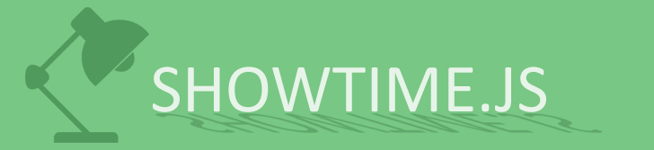

#

# showtime.js

Showtime is a lightweight framework for easily creating stunning tours around your web app.
It comes with a built in chain so its really easy to mix your tours with custom functionality.

**Demo:** http://apps.tweecode.com/custom/showtime/
### Usage
Download showtime.js and include it in your html.
```html
<script src="showtime.js"></script>
<button onclick="tour.start()" style="position: relative; z-index: 10000;">Take a tour</button>
<div class="element">Lorem ipsum</div>
<script>
var tour = new Showtime()
    .show({
        element: document.querySelector('.element'),
        title: 'hey I have a title.',
        content: '<p>This is the tooltip content</p>',
        placement: 'right',
        buttons: [
            {
                label: 'Quit',
                click: function () {
                    tour.quit()
                }
            },
            {
                label: 'Next',
                click: function () {
                    tour.next()
                }
            }
        ]
    })
    .call(function () {
        alert('This was a short tour');
    });
</script>
```
From this point you can chain as many show, modal and call functions you like to the showtime chain.
Sometimes you end up with a lot of repetitions. so to make your code pretty you can define global defaults for the chain like in the example below.

Example code
```javascript
var tour = new Showtime({ 
    //these options will become default for all .show functions chained on this instance
    padding: 10,
    removeOnOuterClick: true,
    focusClick: function () {
        tour.next();
    },
    buttons: [
        {
            label: 'Quit',
            click: function () {
                tour.quit()
            }
        },
        {
            label: 'Next',
            click: function () {
                tour.next()
            }
        }
    ]
})
.show({
    element: '.leftMenu',
    title: 'hey I have a title again.',
    placement: 'right',
    content: '<p>This is a ball</p>',
    dimentions: {
        height: 400 // We can override the dementions of the focuspoint. top, left, height, width
    },
    focusClick: function () { // Hijack the event for the selected element to do whatever you want
        tour.next();
    },
    buttons: [
        {
            label: 'quit',
            click: function () {
                tour.quit()
            }
        },
        {
            label: 'next',
            click: function () {
                tour.next()
            }
        }
    ]
})
.modal({
    title: 'Modal title',
    message: 'this can contain <strong>HTML</strong>'
})
.call(function () {
    console.log('foobar');
})
.show({
    element: '.topMenu',
    placement: 'top',
    content: '<p>Lorem ipsum</p>'
})
.show({
    element: '.filterButtons',
    placement: 'bottom',
    content: '<p>Lorem ipsum</p>',
    focusClick: function () {
        alert('Thats all folks');
    },
});
```
### Showtime functions
tour.show([options])  
tour.call([function])  
tour.modal([options])  

### Controls
```javascript
// start the tour
tour.start();
// Run the next function in the chain
tour.next();
// Run the previous function in the chain
tour.previous();
// End the tour
tour.quit();
```

### Show Options
- element //type, class, id, element object, jquery object
- padding //integer, value in px
- buttons //array of objects with label and click
- focusClick //function
- dimentions //object width, height, top, left
- placement //top, left, right, bottom
- removeOnOuterClick
- autoplay //not really tested with call functions
- autoplayDelay

### Modal Options
- title
- message
- withBackdrop
- size //normal large small
- onClose
- onOpen

### TODO
- add keyboard shortcuts
- custom template option for Modal
- set / get cookie
- create themes
